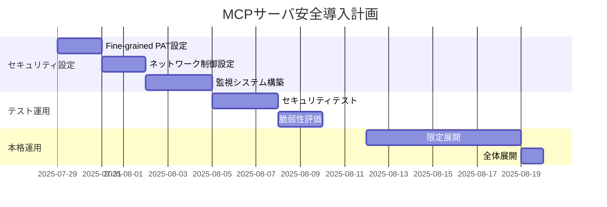

# MCPサーバ利用承認申請書

## 1. 概要

Model Context Protocol (MCP) サーバの導入により、AI開発の効率化とセキュリティを両立した開発環境の構築を提案いたします。本資料では、想定されるセキュリティリスクとその対応策を中心に説明いたします。

## 2. 導入予定MCPサーバ

### 2.1 GitHub MCPサーバ
- **目的**: リポジトリ管理、コードレビュー、Issue管理の効率化
- **主要機能**: リポジトリ情報取得、Issue作成・更新、Pull Request管理

### 2.2 Atlassian MCPサーバ
- **目的**: Confluence文書管理、Jiraタスク管理の効率化
- **主要機能**: ページ作成・更新、Issue管理、プロジェクト情報取得

## 3. 想定リスクと対応策

### 3.1 【リスク1】AIによる意図しないリポジトリアクセス

#### リスクの詳細
- **影響範囲**: Organization内の全リポジトリ
- **想定シナリオ**: AIが指示されていないプロジェクトのコードや機密情報にアクセス
- **影響度**: 高（機密情報漏洩の可能性）

#### 対応策
**Fine-grained Personal Access Token (PAT) による制限**

```yaml
設定例:
Repository access: Selected repositories only
許可リポジトリ:
- project-a-repo
- project-b-repo  
- documentation-repo

Repository permissions:
- Contents: Read only
- Issues: Write
- Pull requests: Write
- Metadata: Read only

Account permissions: なし（最小権限）
```

**技術的実装**
```bash
# 環境変数での安全な管理
export GITHUB_PERSONAL_ACCESS_TOKEN="ghp_xxxxxxxxxxxx"
export GITHUB_REPOSITORY_WHITELIST="org/repo1,org/repo2"

# 設定ファイル例
{
  "mcpServers": {
    "github": {
      "command": "npx",
      "args": ["-y", "@modelcontextprotocol/server-github"],
      "env": {
        "GITHUB_PERSONAL_ACCESS_TOKEN": "${GITHUB_PERSONAL_ACCESS_TOKEN}",
        "GITHUB_REPOSITORY_WHITELIST": "${GITHUB_REPOSITORY_WHITELIST}"
      }
    }
  }
}
```

**監視・検証方法**
```bash
# アクセス可能リポジトリの確認
curl -H "Authorization: token YOUR_TOKEN" \
     https://api.github.com/user/repos

# 権限の確認
curl -H "Authorization: token YOUR_TOKEN" \
     https://api.github.com/applications/grants
```

### 3.2 【リスク2】リモートMCPサーバによる外部通信リスク

#### リスクの詳細
- **影響範囲**: Atlassian MCPサーバ
- **想定シナリオ**: 外部サーバとの通信による情報漏洩、中間者攻撃
- **影響度**: 中（通信経路での情報傍受）

#### 対応策
**通信セキュリティの強化**

| 対策項目 | 実装内容 | 効果 |
|----------|----------|------|
| **暗号化通信** | HTTPS/TLS 1.3強制 | 通信内容の保護 |
| **証明書検証** | SSL証明書の厳密な検証 | 中間者攻撃防止 |
| **IP制限** | Atlassian公式IPのみ許可 | 不正サーバへの接続防止 |
| **VPN経由** | 企業VPN経由での通信 | 通信経路の保護 |

**ネットワークレベル制御**
```bash
# ファイアウォール設定（Atlassian公式IPのみ許可）
sudo ufw allow out to 104.192.136.0/21 port 443
sudo ufw allow out to 185.166.140.0/22 port 443
sudo ufw deny out to any port 443

# DNS設定での制限
echo "104.192.136.1 your-domain.atlassian.net" >> /etc/hosts
```

**リモート vs ローカルMCPの比較検討**

| 項目 | リモートMCP | ローカルMCP | 推奨 |
|------|-------------|-------------|------|
| **セキュリティ** | 外部通信あり | 内部通信のみ | ローカル |
| **可用性** | インターネット依存 | オフライン可能 | ローカル |
| **機能性** | 最新機能利用可能 | 機能制限あり | リモート |
| **監査性** | 外部ログ依存 | 内部ログ完全制御 | ローカル |

### 3.3 【リスク3】認証情報の漏洩・悪用

#### リスクの詳細
- **影響範囲**: GitHub PAT、Atlassian API Token
- **想定シナリオ**: 設定ファイルの誤共有、環境変数の漏洩
- **影響度**: 高（なりすましアクセス）

#### 対応策
**認証情報の安全な管理**

```bash
# 1. 環境変数での管理（設定ファイルに直接記載しない）
export GITHUB_PAT="ghp_xxxxxxxxxxxx"
export ATLASSIAN_TOKEN="xxxxxxxxxxxx"

# 2. 権限ファイルの制限
chmod 600 ~/.mcp_config
chown $USER:$USER ~/.mcp_config

# 3. .gitignoreへの追加
echo ".mcp_config" >> .gitignore
echo ".env" >> .gitignore
```

**定期的なローテーション**
```yaml
ローテーション計画:
- GitHub PAT: 90日ごと
- Atlassian Token: 90日ごと
- 緊急時: 即座に無効化・再発行

自動化スクリプト例:
#!/bin/bash
# トークンの有効期限チェック
if [ $(date -d "+7 days" +%s) -gt $TOKEN_EXPIRY ]; then
    echo "Warning: Token expires in 7 days"
    # 通知処理
fi
```

### 3.4 【リスク4】機密情報への意図しないアクセス

#### リスクの詳細
- **影響範囲**: 個人情報、財務情報、機密技術情報
- **想定シナリオ**: AIが機密データを含むページ・リポジトリにアクセス
- **影響度**: 最高（法的リスク、競合優位性の喪失）

#### 対応策
**データ分類とアクセス制御**

```yaml
アクセス許可データ:
レベル1（公開）:
- 公開ドキュメント
- オープンソースコード
- 一般的な技術情報

レベル2（内部）:
- 開発ドキュメント
- 非機密プロジェクト情報
- 技術仕様書

アクセス禁止データ:
レベル3（機密）:
- 個人情報（PII）
- 財務情報
- 機密技術情報
- 人事情報
- 契約情報
```

**Confluence/Jira権限設定**
```yaml
Confluence設定:
Space permissions:
- 開発チーム用スペースのみ
- 機密スペースは除外
Page permissions:
- 読み取り: 技術ドキュメントのみ
- 編集: 指定ページのみ

Jira設定:
Project permissions:
- 開発プロジェクトのみ
- 人事・財務プロジェクト除外
Issue permissions:
- 閲覧: 技術Issue
- 編集: 限定的な更新のみ
```

### 3.5 【リスク5】過度な権限昇格・権限の濫用

#### リスクの詳細
- **影響範囲**: システム全体
- **想定シナリオ**: AIが管理者権限を要求、不正な操作を実行
- **影響度**: 高（システム破壊、データ削除）

#### 対応策
**最小権限の原則の徹底**

```yaml
GitHub権限制限:
- Admin: なし
- Write: 必要最小限のリポジトリのみ
- Read: 指定リポジトリのみ
- Delete: 一切許可しない

Atlassian権限制限:
- System Admin: なし
- Project Admin: なし
- Space Admin: なし
- User: 読み取り・限定的編集のみ
```

**操作ログの監視**
```bash
# GitHub API使用量監視
curl -H "Authorization: token $GITHUB_TOKEN" \
     https://api.github.com/rate_limit

# Atlassian監査ログ確認
curl -u email:token \
     "https://your-domain.atlassian.net/rest/api/3/auditing/record"
```

### 3.6 【リスク6】サービス可用性への依存

#### リスクの詳細
- **影響範囲**: 開発業務全体
- **想定シナリオ**: GitHub/Atlassianサービス障害、API制限
- **影響度**: 中（業務継続性への影響）

#### 対応策
**冗長性とフォールバック**

```yaml
対策:
1. 複数認証方式の準備:
   - Primary: Fine-grained PAT
   - Backup: Classic PAT（制限付き）
   
2. ローカルキャッシュ:
   - 重要データのローカル保存
   - オフライン作業の継続性確保
   
3. 代替手段の準備:
   - 手動操作手順の文書化
   - 緊急時の連絡体制
```

## 4. 総合的なセキュリティ対策

### 4.1 監視・検知システム

```bash
# 異常検知項目
- API使用量の急激な増加
- 未承認リポジトリへのアクセス試行
- 権限昇格の試行
- 大量データダウンロード
- 異常な時間帯でのアクセス

# アラート設定例
if [ $API_CALLS_PER_HOUR -gt 1000 ]; then
    send_alert "Unusual API usage detected"
fi
```

### 4.2 インシデント対応計画

```yaml
レベル1（軽微）:
- 対応時間: 24時間以内
- 対応者: 開発チーム
- 例: API制限到達

レベル2（重要）:
- 対応時間: 4時間以内
- 対応者: セキュリティチーム
- 例: 未承認アクセス検知

レベル3（緊急）:
- 対応時間: 1時間以内
- 対応者: 全社対策本部
- 例: 機密情報漏洩疑い
```

## 5. 導入計画とマイルストーン



## 6. 承認基準と条件

### 6.1 承認条件
- [ ] Fine-grained PATによるアクセス制限の実装
- [ ] ネットワークレベルでの通信制御
- [ ] 機密データへのアクセス制限
- [ ] 監視・ログシステムの構築
- [ ] インシデント対応計画の策定

### 6.2 定期レビュー
- **頻度**: 月次
- **確認項目**: アクセス権限、使用状況、セキュリティログ
- **責任者**: セキュリティ管理者

## 7. 結論

提案するMCPサーバの導入は、上記のリスク対策により以下を実現します：

✅ **セキュリティの確保**: 多層防御によるリスク最小化  
✅ **業務効率の向上**: AI支援による開発作業の効率化  
✅ **監査可能性**: 全操作の記録と追跡  
✅ **柔軟な制御**: 状況に応じた権限調整  

適切なリスク管理により、安全かつ効果的なAI開発環境を構築できます。

---

**申請者**: [申請者名]  
**申請日**: 2025年7月29日  
**承認者**: [承認者名]  
**承認日**: [承認日]
